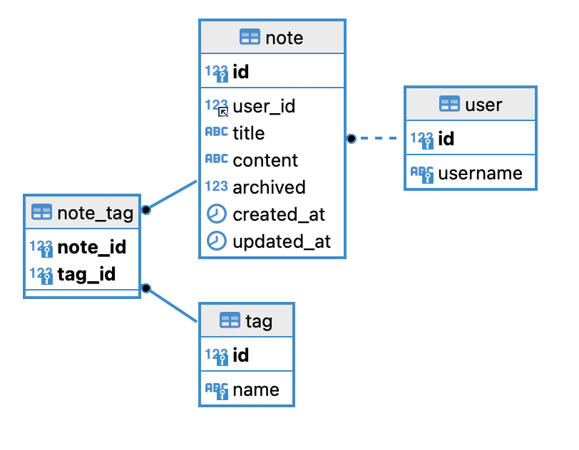

# Notes Application
## Spring Boot + Spring Data JPA CRUD REST API Example

This application is a solution to a full stack implementation exercise. The goal of this exercise is to implement a simple web application that allows users to take notes, tag them, and filter them.
This is just the backend, and features a simple CRUD REST API built with Spring Boot and Spring Data JPA. It uses a MySQL database which is set up using Docker.


## Prerequisites

- Docker installed on your machine
- Java 8 or higher
- Maven
- Postman (for testing the API endpoints)

## Local setup

1. Download or clone the source code from GitHub to a local machine.

2. Navigate to the project directory in your terminal.

3. Build the Docker image for the MySQL database:

```bash
docker build -t mysql_notes_db .
```

4. Run the Docker container:

```bash
docker run -d --name mysql_notes_container -p 3306:3306 mysql_notes_db
```

5. Start the Docker container:

```bash
docker start mysql_notes_container
```

6. Install the project dependencies and build the project:

```bash
mvn clean install
```

7. Run the application:

```bash
mvn spring-boot:run
```

The application should now be running at http://localhost:50000.

## API Documentation
A Postman collection is provided for testing the API endpoints. You can import this collection into your Postman application. If you're not familiar with how to do this, please refer to the [Postman documentation](./docs/Notes%20Application.postman_collection.json).

## Database Schema
The database schema is defined in the `schema.sql` file. This script is automatically executed when the Docker container is started, setting up the database and populating it with some initial data.
